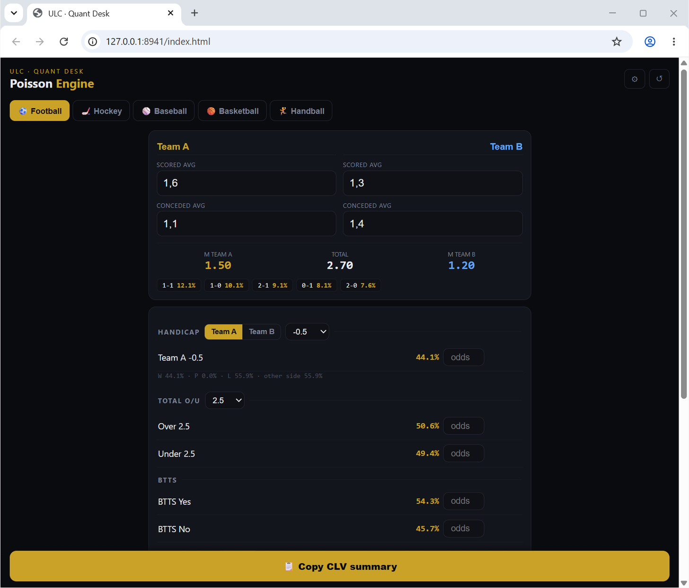

# Quant Desk

Telegram Mini App pricing five sports markets with Poisson and Normal models, Kelly stakes and CLV summaries.

[](LICENSE)



## Quick start

No build step, no dependencies — a single static page. Tested 2026-09-11
on Windows 11 (serve locally, open in Chrome; works the same from any
static host):

```powershell
cd C:\Dev\quant-desk
python -m http.server 8941
```

Then open `http://127.0.0.1:8941/index.html`. State auto-saves to
localStorage (Telegram DeviceStorage when running inside Telegram).

## How it works

Two sports families, two models, five tabs:

- **Football, Hockey, Baseball** — Independent Poisson on expected
  scores. Enter each side's scored/conceded means plus fixture
  assumptions (home edge, draw correlation where drawn games exist) and
  it prices 1X2, totals, BTTS, team totals and handicaps.
- **Basketball, Handball** — Normal model (large-λ Poisson) on points,
  with spread and total markets.

For every leg it compares your model's true probability against the
bookie's implied price and reports the edge in percentage points. Legs at
≥+5pp on growth-bankroll markets get a ¼-Kelly stake off the bankroll you
set; result/BTTS/team-total value is fenced into a separate R5
entertainment pool. A "How it loses" line under each pick states the
game-script that kills it, and one tap copies a CLV summary for the slip.

## Limitations

- The model is only as good as the means you type in. Garbage xG in,
  garbage edge out — it prices your assumptions, it does not make them.
- Draws are volatility-sensitive: if either side is significantly more
  clinical than modeled, draw-heavy books fail first.
- Growth bankroll legs are handicaps/spreads/totals only; result, BTTS
  and team-total value stays fun-pool by design, not by accident.
- No live odds feed. You enter the bookie's prices by hand, which is the
  whole point — the edge is model vs book, typed in by you.

## Development

Single `index.html`, no framework, no tests. Open it, change it, reload.
Keep it that way — the file is the app.

## License

MIT. See [LICENSE](LICENSE).
